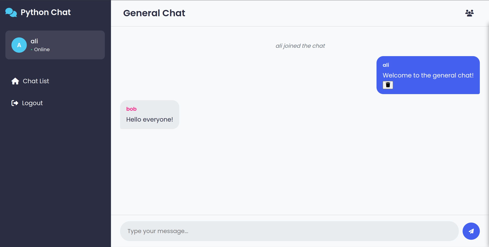
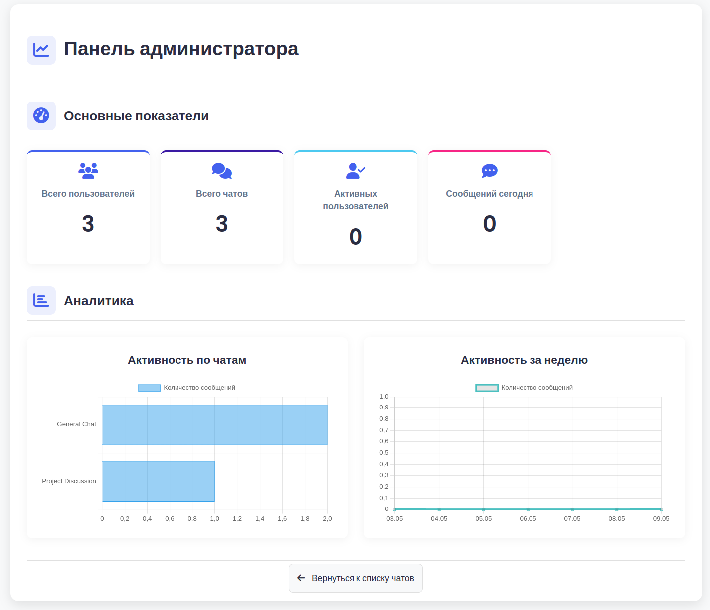

<h1 align="center">Python Chat App 💬</h1>

A real-time chat application built with Python, Flask, Socket.IO, and PostgreSQL.




## Features

- 🔒 User registration and authentication system
- 💬 Real-time messaging using Socket.IO
- 👥 Multiple chat rooms support
- 👤 User profiles
- 🛡️ Admin dashboard for system management
- 📱 Responsive UI design
- 🔄 Real-time notifications

## Technology Stack

- **Backend**: Python 3, Flask
- **Database**: PostgreSQL
- **Real-time Communication**: Socket.IO, WebSockets
- **Frontend**: HTML, CSS, JavaScript
- **Containerization**: Docker, Docker Compose
- **Testing**: pytest

## Prerequisites

- Python 3.11+ (3.13 recommended)
- Docker and Docker Compose
- Make

## Installation and Setup

### Run the App Locally

1. Clone the repository:
```bash
git clone https://github.com/samurajey/python-chat.git
```

2. Navigate to the project directory:
```bash
cd python-chat
```

3. Run init script to create virtual environment and install dependencies:
```bash
make init
```

4. Activate the virtual environment:
```bash
source .venv/bin/activate
```

5. Start the PostgreSQL database using Docker Compose:
```bash
docker compose up -d
```

6. Run the app:
```bash
python run.py
```

7. Open your browser and go to:
```
http://127.0.0.1:5000
```

## Project Structure

```
python-chat/
├── .github/                # CI/CD workflows (e.g., GitHub Actions)
├── images/                 # Screenshots and images for README
├── plantuml/               # UML diagrams
├── python_chat/            # Application source code
│   ├── __init__.py
│   ├── app.py              # Flask application setup
│   ├── database/           # Database models and initialization logic
│   │   ├── __init__.py
│   │   ├── db_init.py      # Core database initialization functions
│   │   └── models/         # SQLAlchemy models (e.g., user.py, chat.py)
│   ├── forms/              # WTForms for form handling (e.g., auth.py)
│   │   └── __init__.py
│   ├── routes/             # Flask blueprints/routes (e.g., auth.py, events.py)
│   │   └── __init__.py
│   └── utils/              # Utility functions (e.g., logger.py)
│       └── __init__.py
├── static/                 # Static assets
│   ├── js/                 # JavaScript files
│   └── styles/             # CSS files
├── templates/              # Jinja2 HTML templates
│   └── components/         # Reusable template components (e.g., header.html)
├── tests/                  # Test suite
├── db_init.py              # Main script to initialize the database
├── docker-compose.yaml     # Docker Compose configuration for services
├── Makefile                # Make commands for common development tasks
├── poetry.lock             # Poetry: exact versions of dependencies
├── pyproject.toml          # Poetry: project metadata and dependencies
├── README.md               # This file: project overview and instructions
└── run.py                  # Application entry point to start the server
```

## Architecture

The application follows a modular architecture with Flask blueprints for different parts of the application:

- **Authentication**: User registration, login, and session management
- **Chat**: Real-time messaging using Socket.IO
- **Profiles**: User profile management
- **Admin**: Admin dashboard for system management

### Database Schema

The main entities in the application are:
- Users
- Chats (rooms)
- Chat Members
- Chat Messages

## Development

### Running Tests
```bash
make test
```

### Running Tests with Coverage
```bash
make test-cov
```

### Code Formatting and Linting
```bash
# Format code with Ruff
make pretty

# Run linting checks
make lint
```

### Cleaning Up
```bash
# Remove virtual environment and generated files
make clean
```

## Authors

- Sergey Zaremba (main dev)
- Dmitriy Chernyavski (db models, html templates fixes)
