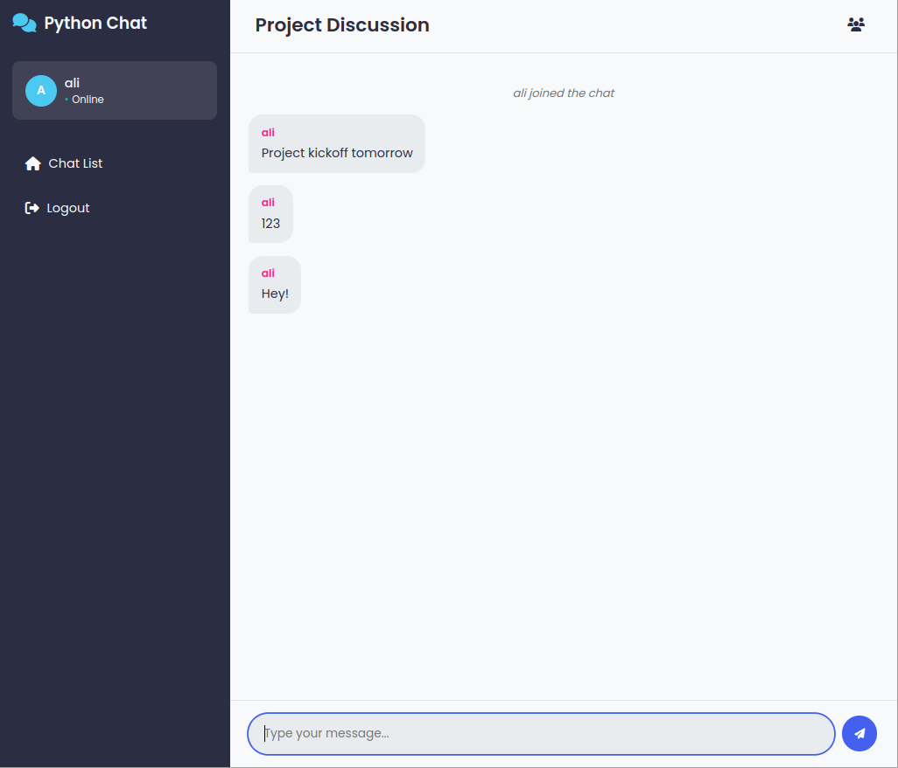

# Презентация: Python Chat App
### 21 мая 2025 г.



---
<!-- TODO надо поменять  -->
## Введение

Python Chat App - это современное веб-приложение для обмена сообщениями, разработанное с использованием Python и Flask на бэкенде, а также JavaScript на фронтенде.

Приложение предоставляет удобный и функциональный интерфейс для общения пользователей как в личных, так и в групповых чатах.

---

## Технический стек

- **Бэкенд**: Python, Flask, Flask-SocketIO
- **Фронтенд**: JavaScript, HTML, CSS
- **База данных**: PostgreSQL
- **Контейнеризация**: Docker
- **Тестирование**: Pytest

---

## Основные функциональные возможности

---

### Система пользователей
- Регистрация и аутентификация пользователей
- Профили пользователей со статистикой
- Разделение ролей (обычные пользователи и администраторы)


---

### Система чатов
- Создание личных (приватных) и групповых чатов
- Поиск пользователей для добавления в чаты
- Отображение статуса онлайн пользователей


---

### Обмен сообщениями
- Мгновенный обмен сообщениями в реальном времени (Socket.IO)
- Уведомления о печатании сообщений
- История сообщений с возможностью просмотра
- Удаление сообщений


---

### Модерация
- Назначение модераторов в чатах
- Возможность блокировать пользователей в чатах
- Просмотр списка заблокированных пользователей
- Возможность разблокировать пользователей


---

### Административная панель
- Мониторинг активности пользователей
- Статистика использования приложения
- Графики активности чатов и пользователей


---

## Архитектура приложения

---

### Серверная часть

<!-- _class: lead -->

**Модули маршрутизации:**
- `auth.py` — аутентификация
- `chats.py` — чаты
- `events.py` — Socket.IO события
- `admin.py` — админ-функции
- `profile.py` — профили
---
**Модели данных:**
- `User` — пользователи
- `Chat` — чаты
- `ChatMember` — участники
- `ChatMessage` — сообщения

---

### Web Socket обработчики

- Подключение пользователей
- Отправка и получение сообщений
- Уведомления о действиях пользователей

```javascript
socket.on("receive_message", (data) => {
    addMessage(data.message, "user", data.username, data.message_id);
});

socket.on("user_banned", (data) => {
    addMessage(`${data.username} has been banned`, "system");
});
```

---

### Клиентская часть

<div class="columns">
<div>

#### Основные страницы:
- Страница входа и регистрации
- Список доступных чатов
- Страница чата с сообщениями
- Профиль пользователя
- Административная панель

</div>
<div>

#### JavaScript-модули:
- `web_socket.js` - работа с WebSocket
- `create_chat.js` - создание новых чатов
- `admin_dashboard.js` - админ-панель

</div>
</div>

---

## Процесс взаимодействия пользователя

---

### Регистрация/авторизация

- Пользователь регистрируется/входит в систему
- После успешной авторизации перенаправляется на список чатов


---

### Работа с чатами

- Пользователь может создавать новые чаты (личные или групповые)
- Присоединяться к существующим чатам
- Просматривать список участников чата


---

### Обмен сообщениями

- Отправка и получение сообщений в реальном времени
- Просмотр истории сообщений
- Удаление своих сообщений


---

### Модерация

- Модераторы могут блокировать пользователей
- Просматривать список заблокированных пользователей
- Разблокировать пользователей


---

## Интерфейс пользователя

Интерфейс приложения разработан с учетом современных тенденций в веб-дизайне:

- Адаптивный дизайн для различных устройств
- Интуитивно понятная навигация
- Визуальное разделение сообщений (свои/чужие)
- Системные уведомления о событиях в чате

---

## Особенности реализации

---

### WebSocket для обмена сообщениями

Использование технологии WebSocket (Socket.IO) обеспечивает передачу сообщений в реальном времени без необходимости постоянно опрашивать сервер, что значительно снижает нагрузку и улучшает пользовательский опыт.


---

### Модульная архитектура

Приложение построено по модульному принципу, что облегчает поддержку и расширение функционала. Каждый модуль отвечает за определенную часть функционала.


---

### Безопасность

- Хранение паролей в хешированном виде
- Защита от несанкционированного доступа к чатам
- Разграничение прав доступа для различных ролей


---

## Сложности при разработке

- Реализация обмена сообщениями в реальном времени (WebSocket, обработка событий)
- Обеспечение безопасности (аутентификация, хранение паролей, разграничение прав)
- Масштабируемость (работа с большим количеством пользователей и чатов)
- Согласованность данных между клиентом и сервером
- Обработка ошибок и устойчивость к сбоям
- Удобный и интуитивный интерфейс

---

## Плюсы и минусы выбранной архитектуры

**Плюсы:**
- Простота и прозрачность архитектуры (Flask + Socket.IO)
- Легко расширять и поддерживать
- Быстрая разработка и внедрение новых функций
- Хорошая интеграция с современными фронтенд-технологиями

**Минусы:**
- Ограниченная масштабируемость Flask по сравнению с асинхронными фреймворками
- Возможные сложности с горизонтальным масштабированием WebSocket
- Необходимость дополнительной настройки для высокой отказоустойчивости
- Для крупных проектов может потребоваться переход на более сложные решения (например, микросервисы)

## Будущие улучшения

- Добавление поддержки медиафайлов в сообщениях
- Реализация системы уведомлений
- Шифрование сообщений
- Мобильное приложение
- Расширенная система аналитики
- Поддержка нескольких языков интерфейса
- Удобства бекенда - CI/CD, тестирование и мониторинг

---

## Заключение

Python Chat App представляет собой полнофункциональное веб-приложение для обмена сообщениями. 

Использование популярных технологий, таких как Flask и Socket.IO, обеспечивает стабильную работу и хорошую производительность.
